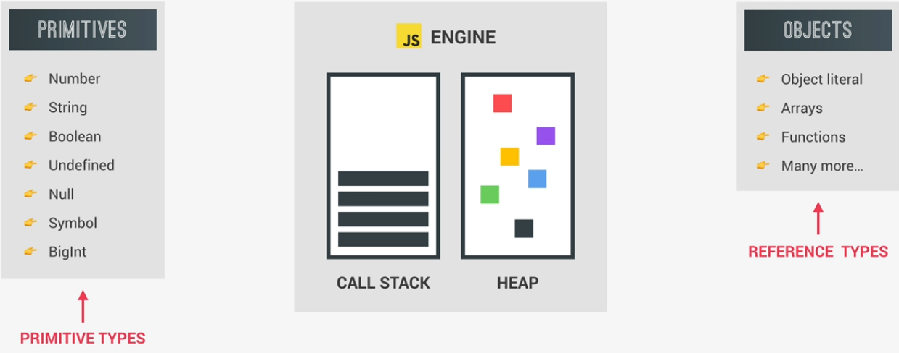
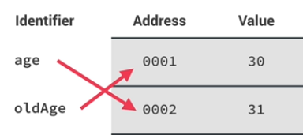

# Primitives vs Objects

```js
// Objects vs. primitives
let age = 30;
let oldAge = age;
age = 31;
console.log(age); // 31
console.log(oldAge); // 30

const me = {
  name: 'Jonas',
  age: 30,
};
const friend = me;
friend.age = 27;
console.log('Friend:', friend); // Friend: {name: "Jonas", age: 27}
console.log('Me', me); // Me: {name: "Jonas", age: 27}
```

JavaScript Engine hass 2 components:

- Call Stack - where functions are executed
- Heap - where objects are stored in memory



All our Objects (Reference Types: Object literal, Arrays, Functions, etc.) will get stored in the Memory Heap.

On the the other hand, Primitives or Primitive Types are stored in the Call Stack. Primitive Types are stored in the execution contexts in which they are declared.

## Call Stack

JavaScript will create a so called unique identifier with the variable name. Then a piece of Memory will be allocated with a certain Address (0001 for example) and finally the value will be stored in Memory at the specified Address.

- The value 30 will be specified at Memory Address 0001

```js
let age = 30;
let oldAge = age;
age = 31;
console.log(age); // 31
console.log(oldAge); // 30
```

- **Extremely important to understand here** is that the identifier actually **points to the Address** and not to the value itself. So we would say that the age variable is equal to 30 BUT in fact is equal to the Memory Address 0001 which holds the value 30.
  

- **So a Variable holds a Memory Address!!!**
- Next we declare oldAge = age and it will simply point to the same Memory Address 0001.
- Then we declare variable age again, then it will create a new Memory Address and will simply point to it.
  
