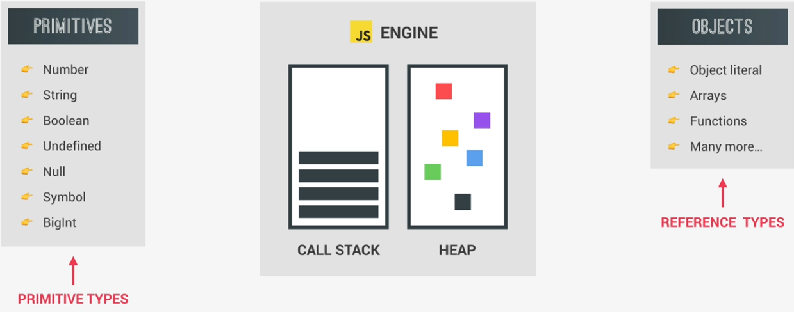
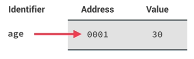
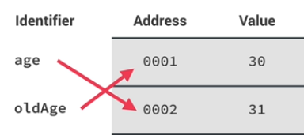
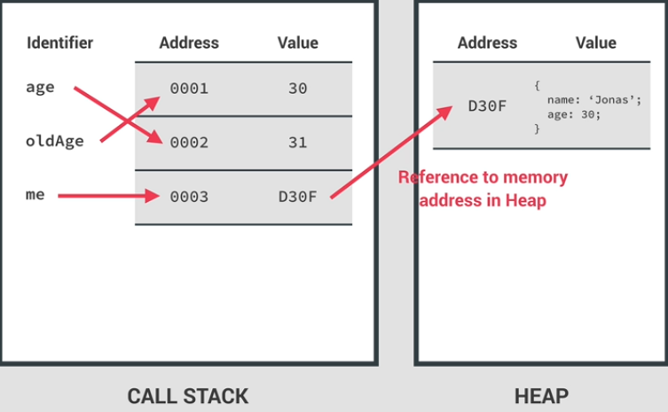
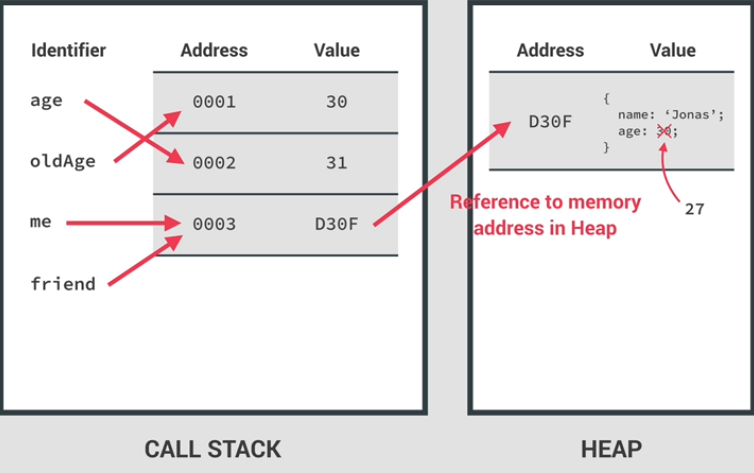
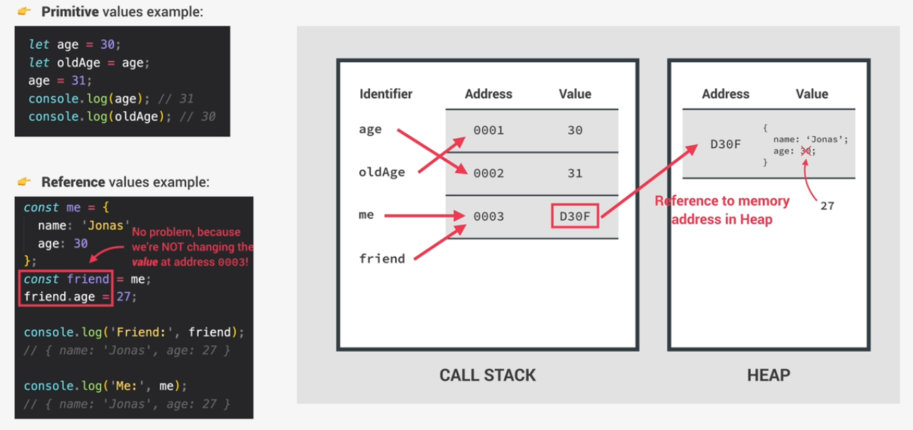

# Primitives vs Objects

```js
// Objects vs. primitives
let age = 30;
let oldAge = age;
age = 31;
console.log(age); // 31
console.log(oldAge); // 30

const me = {
  name: 'Jonas',
  age: 30,
};
const friend = me;
friend.age = 27;
console.log('Friend:', friend); // Friend: {name: "Jonas", age: 27}
console.log('Me', me); // Me: {name: "Jonas", age: 27}
```

JavaScript Engine has 2 components:

- Call Stack - where functions are executed
- Heap - where objects are stored in memory



All our Objects (Reference Types: Object literal, Arrays, Functions, etc.) will get stored in the Memory Heap.

On the the other hand, Primitives or Primitive Types are stored in the Call Stack. Primitive Types are stored in the execution contexts in which they are declared.

## Call Stack

JavaScript will create a so called unique identifier with the variable name. Then a piece of Memory will be allocated with a certain Address (0001 for example) and finally the value will be stored in Memory at the specified Address.

- The value 30 will be specified at Memory Address 0001

```js
let age = 30;
let oldAge = age;
age = 31;
console.log(age); // 31
console.log(oldAge); // 30
```

- **Extremely important to understand here** is that the identifier actually **points to the Address** and not to the value itself. So we would say that the Identifier (age variable) is equal to 30 BUT in fact is equal to the Memory Address 0001 which holds the value 30.
  

- **So a Variable holds a Memory Address!!!**
- Next we declare oldAge = age and it will simply point to the same Memory Address 0001.
- Then we declare the Identifier age again, then it will create a new Memory Address and will simply point to it.
  

## Reference Values

- When a new Object is created, it is stored in the **Heap** with an Address and a Value.
- But it will also create a Address and a Value, stored in **Call Stack**.
- The difference is that the "me" Identifier will point to the new Address 0003 with the Value D30F which points to the Heap Address
  
- In other words, the piece of memory in the Call Stack has a reference to the piece of memory in the Heap, which holds "me" object.
- That's the reason why we all objects, reference types in this context.
- **So again, when we declare a Variable as an Object, an Identifier is created, which points to a piece of memory in the Stack, which in turn points to a piece of memory in the Heap**
  - It works this way, because Objects might be too large to be stored in the stack, instead they are stored in the heap which is like an unlimited memory pool, and the stack just keeps a reference to where the object is actually stored in the heap so that it can find it whenever necessary.
- Moving to the code, we create a new variable friend that we set equal to the "me" object.
  - The an Identifier "friend" will be created, and will point to the exact same Memory Address as the "me" Identifier.
  - And again, that Address contains the reference which then points to the object itself. And like this the "friend" object is now essentially the exact same model as the "me" object.
  - Now we change a property in the "friend" object by setting friend.age to 27. So what happens then is that the object is found in the heap, and the 30 is changed to 27.
    
  - Also, even if we defiend "friend" as a constant we can still manipulate the object without problems. And it makes sense, becaseu we are NOT changing the value in the memory for the "friend" Identifier, it is still D30F (the refference to the object).

```js
const me = {
  name: 'Jonas',
  age: 30,
};
const friend = me;
friend.age = 27;
console.log('Friend:', friend); // Friend: {name: "Jonas", age: 27}
console.log('Me', me); // Me: {name: "Jonas", age: 27}
```

- There is misconception that all variables declared with const are immutable. In fact that is only true for primitive values, but not for reference values.
  
